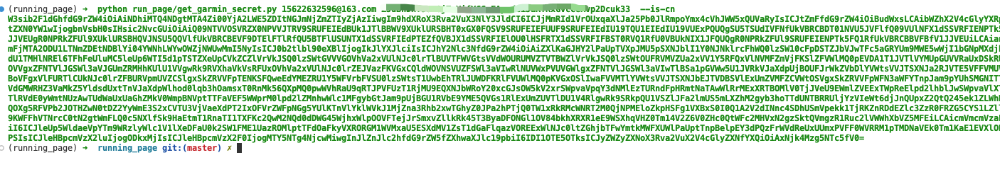
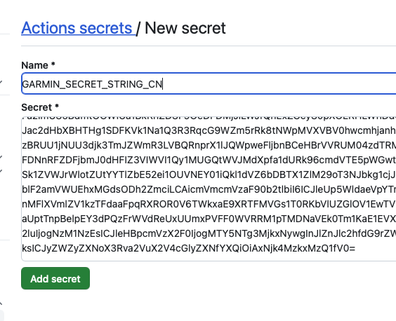

## note1: clone or Fork before vercel 404 need to pull the latest code

## note2: python3(python) in README means python3 python

## note3: use v2.0 need change vercel setting from gatsby to vite.

## note4: 2023.09.26 garmin need secret_string(and in Actions) get `python run_page/garmin_sync.py ${email} ${password}` if cn `python run_page/garmin_sync.py ${email} ${password} --is-cn`

<p align="center">
  
</p>

<h3 align="center">
  <a href="https://yihong.run"> Create a personal running home page </a>
</h3>

<p align="center">
  <a href="https://github.com/yihong0618/running_page/actions"></a>
  <a href="https://t.me/running_page"></a>
</p>

<p align="center">
  
</p>

English | [简体中文](https://github.com/yihong0618/running_page/blob/master/README-CN.md) | [Wiki](https://mfydev.github.io/Running-Page-Wiki/)

## [Runner's Page Show](https://github.com/yihong0618/running_page/issues/12)

<details>
<summary>Running page runners</summary>

| Runner                                            | page                                           | App         |
| ------------------------------------------------- | ---------------------------------------------- | ----------- |
| [zhubao315](https://github.com/zhubao315)         | <https://zhubao315.github.io/running>          | Strava      |
| [shaonianche](https://github.com/shaonianche)     | <https://run.duanfei.org>                      | Strava      |
| [yihong0618](https://github.com/yihong0618)       | <https://yihong.run>                           | Nike        |
| [superleeyom](https://github.com/superleeyom)     | <https://running.leeyom.top>                   | Nike        |
| [geekplux](https://github.com/geekplux)           | <https://activities.geekplux.com>              | Nike        |
| [guanlan](https://github.com/guanlan)             | <https://grun.vercel.app>                      | Strava      |
| [tuzimoe](https://github.com/tuzimoe)             | <https://run.tuzi.moe>                         | Nike        |
| [ben_29](https://github.com/ben-29)               | <https://running.ben29.xyz>                    | Strava      |
| [kcllf](https://github.com/kcllf)                 | <https://running-tau.vercel.app>               | Garmin-cn   |
| [mq](https://github.com/MQ-0707)                  | <https://running-iota.vercel.app>              | Keep        |
| [zhaohongxuan](https://github.com/zhaohongxuan)   | <https://zhaohongxuan.github.io/workouts>      | Strava      |
| [yvetterowe](https://github.com/yvetterowe)       | <https://run.haoluo.io>                        | Strava      |
| [love-exercise](https://github.com/KaiOrange)     | <https://run.kai666666.top>                    | Keep        |
| [zstone12](https://github.com/zstone12)           | <https://running-page.zstone12.vercel.app>     | Keep        |
| [Lax](https://github.com/Lax)                     | <https://lax.github.io/running>                | Keep        |
| [lusuzi](https://github.com/lusuzi)               | <https://running.lusuzi.vercel.app>            | Nike        |
| [wh1994](https://github.com/wh1994)               | <https://run4life.fun>                         | Garmin      |
| [liuyihui](https://github.com/YiHui-Liu)          | <https://run.foolishfox.cn>                    | Keep        |
| [sunyunxian](https://github.com/sunyunxian)       | <https://sunyunxian.github.io/running_page>    | Strava      |
| [AhianZhang](https://github.com/AhianZhang)       | <https://running.ahianzhang.com>               | Nike        |
| [L1cardo](https://github.com/L1cardo)             | <https://run.licardo.cn>                       | Nike        |
| [luckylele666](https://github.com/luckylele666)   | <https://0000928.xyz>                          | Strava      |
| [MFYDev](https://github.com/MFYDev)               | <https://mfydev.run>                           | Garmin-cn   |
| [Eished](https://github.com/eished)               | <https://run.iknow.fun>                        | Keep        |
| [Liuxin](https://github.com/liuxindtc)            | <https://liuxin.run>                           | Nike        |
| [loucx](https://github.com/loucx)                 | <https://loucx.github.io/running>              | Nike        |
| [winf42](https://github.com/winf42)               | <https://winf42.github.io>                     | Garmin-cn   |
| [sun0225SUN](https://github.com/sun0225SUN)       | <https://run.sunguoqi.com>                     | Nike        |
| [Zhan](https://www.zlog.in/about/)                | <https://run.zlog.in>                          | Nike        |
| [Dennis](https://run.domon.cn)                    | <https://run.domon.cn>                         | Garmin-cn   |
| [hanpei](https://running.nexts.top)               | <https://running.nexts.top>                    | Garmin-cn   |
| [liugezhou](https://github.com/liugezhou)         | <https://run.liugezhou.online>                 | Strava      |
| [Jason Tan](https://github.com/Jason-cqtan)       | <https://jason-cqtan.github.io/running_page>   | Nike        |
| [Conge](https://github.com/conge)                 | <https://conge.github.io/running_page>         | Strava      |
| [zHElEARN](https://github.com/zHElEARN)           | <https://workouts.zhelearn.com>                | Strava      |
| [Ym9i](https://github.com/Ym9i)                   | <https://bobrun.vercel.app/>                   | Strava      |
| [jianchengwang](https://github.com/jianchengwang) | <https://jianchengwang.github.io/running_page> | Suunto      |
| [fxbin](https://github.com/fxbin)                 | <https://fxbin.github.io/sport-records/>       | Keep        |
| [shensl4499](https://github.com/shensl4499)       | <https://waner.run>                            | codoon      |
| [haowei93](https://github.com/haowei93)           | <https://haowei93.github.io/>                  | gpx         |
| [stevenash0822](https://github.com/stevenash0822) | <https://run.imangry.xyz/>                     | Strava      |
| [Vint](https://github.com/VintLin)                | <https://vinton.store/Running/>                | Keep        |
| [Muyids](https://github.com/muyids)               | <https://muyids.github.io/running>             | Garmin-cn   |
| [Gao Hao](https://github.com/efish2002)           | <https://efish2002.github.io/running_page/>    | Garmin-cn   |
| [Jinlei](https://github.com/iamjinlei0312)        | <https://jinlei.run/>                          | AW-GPX      |
| [RealTiny656](https://github.com/tiny656)         | <https://tiny656.github.io/running_page/>      | JoyRun      |
| [EINDEX](https://github.com/eindex)               | <https://workouts.eindex.me/>                  | Strava/Nike |
| [Melt](https://github.com/fpGHwd)                 | <https://running.autove.dev/>                  | Strava      |
| [deepinwine](https://github.com/deepinwine)       | <https://deepin.autove.dev/>                   | Garmin-cn   |
| [Echo](https://github.com/donghao526)             | <https://donghao526.github.io/running>         | JoyRun      |
| [Jeffggmm](https://github.com/Jeffggmm)           | <https://jeffggmm.github.io/workouts_page/>    | Garmin      |

</details>

## How it works


## Features

1. GitHub Actions manages automatic synchronization of runs and generation of new pages.
2. Support for Vercel (recommended) and GitHub Pages automated deployment
3. React Hooks
4. Mapbox for map display
5. Supports most sports apps such as nike strava...

> automatically backup gpx data for easy backup and uploading to other software.<br>
> Note: If you don't want to make the data public, you can choose strava's fuzzy processing, or private repositories.

## Support

- **[Garmin](#garmin)**
- **[Garmin-CN](#garmin-cnchina)**
- **[Nike Run Club](#nike-run-club)**
- **[Strava](#strava)**
- **[GPX](#gpx)**
- **[TCX](#tcx)**
- **[FIT](#fit)**
- **[Nike_to_Strava(Using NRC Run, Strava backup data)](#nike_to_strava)**
- **[Tcx_to_Strava(upload all tcx data to strava)](#tcx_to_strava)**
- **[Gpx_to_Strava(upload all gpx data to strava)](#gpx_to_strava)**
- **[Garmin_to_Strava(Using Garmin Run, Strava backup data)](#garmin_to_strava)**
- **[Strava_to_Garmin(Using Strava Run, Garmin backup data)](#strava_to_garmin)**

## Download

Clone or fork the repo.

```
git clone https://github.com/yihong0618/running_page.git --depth=1
```

## Installation and testing (node >= 16 python >= 3.8)

```
pip3 install -r requirements.txt
npm install -g corepack && corepack enable && pnpm install
pnpm develop
```

Open your browser and visit <http://localhost:5173/>

## Docker

```
#build
# NRC
docker build -t running_page:latest . --build-arg app=NRC --build-arg nike_refresh_token=""
# Garmin
docker build -t running_page:latest . --build-arg app=Garmin --build-arg secret_string=""
# Garmin-CN
docker build -t running_page:latest . --build-arg app=Garmin-CN --build-arg secret_string=""
# Strava
docker build -t running_page:latest . --build-arg app=Strava --build-arg client_id=""  --build-arg client_secret=""  --build-arg refresh_token=""
#Nike_to_Strava
docker build -t running_page:latest . --build-arg app=Nike_to_Strava  --build-arg nike_refresh_token="" --build-arg client_id=""  --build-arg client_secret=""  --build-arg refresh_token=""

#run
docker run -itd -p 80:80   running_page:latest

#visit
Open your browser and visit localhost:80

```

## Local sync data

### Modifying Mapbox token in `src/utils/const.js`

> If you use English please change `IS_CHINESE = false` in `src/utils/const.js` <br>
> Suggested changes to your own [Mapbox token](https://www.mapbox.com/)

```javascript
const MAPBOX_TOKEN =
  'pk.eyJ1IjoieWlob25nMDYxOCIsImEiOiJja2J3M28xbG4wYzl0MzJxZm0ya2Fua2p2In0.PNKfkeQwYuyGOTT_x9BJ4Q';
```

## Custom your page

- Find `src/static/site-metadata.ts` in the repository directory, find the following content, and change it to what you want.

```javascript
siteMetadata: {
  siteTitle: 'Running Page', #website title
  siteUrl: 'https://yihong.run', #website url
  logo: 'https://encrypted-tbn0.gstatic.com/images?q=tbn:ANd9GcQTtc69JxHNcmN1ETpMUX4dozAgAN6iPjWalQ&usqp=CAU', #logo img
  description: 'Personal site and blog',
  navLinks: [
    {
      name: 'Blog', #navigation name
      url: 'https://yihong.run/running', #navigation url
    },
    {
      name: 'About',
      url: 'https://github.com/yihong0618/running_page/blob/master/README-CN.md',
    },
  ],
},
```

- Modifying styling in `src/utils/const.js`

```javascript
// styling: set to `false` if you want to disable dash-line route
const USE_DASH_LINE = true;
// styling: route line opacity: [0, 1]
const LINE_OPACITY = 0.4;
```

- privacy protection

setting flowing env:

```shell
IGNORE_START_END_RANGE = 200 # ignore distance for each polyline start and end.

IGNORE_RANGE = 200 # ignore meters for each point in below polyline.
IGNORE_POLYLINE = ktjrFoemeU~IorGq}DeB # a polyline include point you want to ignore.

# Do filter before saving to database, you will lose some data, but you can protect your privacy, when you using public repo. enable for set 1, disable via unset.
IGNORE_BEFORE_SAVING =
```

You can using [this](https://developers.google.com/maps/documentation/utilities/polylineutility), to making your `IGNORE_POLYLINE`.

## Download your running data and do not forget to [generate svg in `total` page](#total-data-analysis)

### GPX

<details>
<summary>Make your <code>GPX</code> data</summary>
<br>

Copy all your gpx files to GPX_OUT or new gpx files

```python
python3(python) run_page/gpx_sync.py
```

</details>

### TCX

<details>
<summary>Make your <code>TCX</code> data</summary>
<br>

Copy all your tcx files to TCX_OUT or new tcx files

```python
python3(python) run_page/tcx_sync.py
```

</details>

### FIT

<details>
<summary>Make your <code>FIT</code> data</summary>
<br>

Copy all your tcx files to FIT_OUT or new fit files

```python
python3(python) run_page/fit_sync.py
```

</details>

### Garmin

<details>
<summary>Get your <code>Garmin</code> data</summary>
<br>
If you only want to sync `type running` add args --only-run

If you only want `tcx` files add args --tcx

If you only want `fit` files add args --fit

If you are using Garmin as a data source, it is recommended that you pull the code to your local environment to run and obtain the Garmin secret.
**The Python version must be >=3.8**

#### Get Garmin Secret

Enter the following command in the terminal

```python
# to get secret_string
python3(python) run_page/get_garmin_secret.py ${your email} ${your password}
```

#### Execute Garmin Sync Script

Copy the Secret output in the terminal,If you are using Github, please configure **GARMIN_SECRET_STRING** in Github Action.

```python
# use this secret_string
python3(python) run_page/garmin_sync.py ${secret_string}
```

example：

```python
python3(python) run_page/get_garmin_secret.py xxxxxxxxxxx
```

only-run：

```python
python3(python) run_page/garmin_sync.py xxxxxxxxxxxxxx(secret_string) --only-run
```

</details>

### Garmin-CN(China)

<details>
<summary>Get your <code>Garmin-CN</code> data</summary>
<br>
If you only want to sync `type running` add args --only-run

If you only want `tcx` files add args --tcx

If you only want `fit` files add args --fit

If you are using Garmin as a data source, it is recommended that you pull the code to your local environment to run and obtain the Garmin secret.
**The Python version must be >=3.10**

#### Get Garmin CN Secret

Enter the following command in the terminal

```python
# to get secret_string
python3(python) run_page/get_garmin_secret.py ${your email} ${your password} --is-cn
```



#### Execute Garmin CN Sync Script

Copy the Secret output in the terminal,If you are using Github, please configure **GARMIN_SECRET_STRING_CN** in Github Action.


example：

```python
python3(python) run_page/garmin_sync.py xxxxxxxxx(secret_string) --is-cn
```

only-run：

```python
python3(python) run_page/garmin_sync.py xxxxxxxxxxxxxx(secret_string)  --is-cn --only-run
```

</details>

### Nike Run Club

<details>
<summary>Get your <code>Nike Run Club</code> data</summary>

<br>

> Please note: When you choose to deploy running_page on your own server, due to Nike has blocked some IDC's IP band, maybe your server cannot sync Nike Run Club's data correctly and display `403 error`, then you have to change another way to host it.

Get Nike's `refresh_token`

1. Login [Nike](https://www.nike.com) website
2. In Develop -> Application-> Storage -> https:unite.nike.com look for `refresh_token`

<br>


3. Execute in the root directory:

```python
python3(python) run_page/nike_sync.py ${nike refresh_token}
```

example：

```python
python3(python) run_page/nike_sync.py eyJhbGciThiMTItNGIw******
```


</details>

### Strava

<details>
<summary> Get your <code>Strava</code> data </summary>
<br>

1. Sign in/Sign up [Strava](https://www.strava.com/) account
2. Open after successful Signin [Strava Developers](http://developers.strava.com) -> [Create & Manage Your App](https://strava.com/settings/api)

3. Create `My API Application`: Enter the following information

<br>


Created successfully:

<br>


4. Use the link below to request all permissions: Replace `${your_id}` in the link with `My API Application` Client ID

```
https://www.strava.com/oauth/authorize?client_id=${your_id}&response_type=code&redirect_uri=http://localhost/exchange_token&approval_prompt=force&scope=read_all,profile:read_all,activity:read_all,profile:write,activity:write
```


5. Get the `code` value in the link

<br>

example：

```
http://localhost/exchange_token?state=&code=1dab37edd9970971fb502c9efdd087f4f3471e6e&scope=read,activity:write,activity:read_all,profile:write,profile:read_all,read_all
```

`code` value：

```
1dab37edd9970971fb502c9efdd087f4f3471e6
```


6. Use `Client_id`、`Client_secret`、`Code` get `refresh_token`: Execute in `Terminal/iTerm`

```
curl -X POST https://www.strava.com/oauth/token \
-F client_id=${Your Client ID} \
-F client_secret=${Your Client Secret} \
-F code=${Your Code} \
-F grant_type=authorization_code
```

example：

```
curl -X POST https://www.strava.com/oauth/token \
-F client_id=12345 \
-F client_secret=b21******d0bfb377998ed1ac3b0 \
-F code=d09******b58abface48003 \
-F grant_type=authorization_code
```


7. Sync `Strava` data

> The first time you synchronize Strava data you need to change line 12 of the code False to True in strava_sync.py, and then change it to False after it finishes running.
> If you only want to sync `type running` add args --only-run

```python
python3(python) run_page/strava_sync.py ${client_id} ${client_secret} ${refresh_token}
```

References：

- <https://developers.strava.com/docs/getting-started>
- <https://github.com/barrald/strava-uploader>
- <https://github.com/strava/go.strava>

</details>

### TCX_to_Strava

<details>
<summary>upload all tcx files to strava</summary>

<br>

1. follow the strava steps
2. copy all your tcx files to TCX_OUT
3. Execute in the root directory:

```python
python3(python) run_page/tcx_to_strava_sync.py ${client_id} ${client_secret}  ${strava_refresh_token}
```

example：

```python
python3(python) run_page/tcx_to_strava_sync.py xxx xxx xxx
or
python3(python) run_page/tcx_to_strava_sync.py xxx xxx xxx --all
```

4. if you want to all files add args `--all`

</details>

### GPX_to_Strava

<details>
<summary>upload all gpx files to strava</summary>

<br>

1. follow the strava steps
2. copy all your gpx files to GPX_OUT
3. Execute in the root directory:

```python
python3(python) run_page/gpx_to_strava_sync.py ${client_id} ${client_secret}  ${strava_refresh_token}
```

example：

```python
python3(python) run_page/gpx_to_strava_sync.py xxx xxx xxx
or
python3(python) run_page/tcx_to_strava_sync.py xxx xxx xxx --all
```

4. if you want to all files add args `--all`

</details>

### Nike_to_Strava

<details>
<summary>Get your <code> Nike Run Club </code> data and upload to strava</summary>

<br>

1. follow the nike and strava steps
2. Execute in the root directory:

```python
python3(python) run_page/nike_to_strava_sync.py ${nike_refresh_token} ${client_id} ${client_secret} ${strava_refresh_token}
```

example：

```python
python3(python) run_page/nike_to_strava_sync.py eyJhbGciThiMTItNGIw******  xxx xxx xxx
```

</details>

### Garmin_to_Strava

<details>
<summary>Get your <code>Garmin</code> data and upload to strava</summary>

<br>

1. finish garmin and strava setps
2. Execute in the root directory:

```python
python3(python) run_page/garmin_to_strava_sync.py  ${client_id} ${client_secret} ${strava_refresh_token} ${garmin_secret_string} --is-cn
```

e.g.

```python
python3(python) run_page/garmin_to_strava_sync.py  xxx xxx xxx xx
```

</details>

### Strava_to_Garmin

<details>
<summary>Get your <code>Strava</code> data and upload to Garmin</summary>

<br>

1. finish garmin and strava setps, at the same time, you need to add additional strava config in Github Actions secret: `secrets.STRAVA_EMAIL`,`secrets.STRAVA_PASSWORD`
2. Execute in the root directory:

```python
python3(python) run_page/strava_to_garmin_sync.py ${{ secrets.STRAVA_CLIENT_ID }} ${{ secrets.STRAVA_CLIENT_SECRET }} ${{ secrets.STRAVA_CLIENT_REFRESH_TOKEN }}  ${{ secrets.GARMIN_SECRET_STRING }} ${{ secrets.STRAVA_EMAIL }} ${{ secrets.STRAVA_PASSWORD }}
```

if your garmin account region is **China**, you need to execute the command:

```python
python3(python) run_page/strava_to_garmin_sync.py ${{ secrets.STRAVA_CLIENT_ID }} ${{ secrets.STRAVA_CLIENT_SECRET }} ${{ secrets.STRAVA_CLIENT_REFRESH_TOKEN }}  ${{ secrets.GARMIN_SECRET_STRING_CN }} ${{ secrets.STRAVA_EMAIL }} ${{ secrets.STRAVA_PASSWORD }} --is-cn
```

If you want to add Garmin Device during sync, you should add `--use_fake_garmin_device` argument, this will add a Garmin Device (Garmin Forerunner 245 by default, and you can change device in `garmin_device_adaptor.py`) in synced Garmin workout record, this is essential when you want to sync the workout record to other APP like Keep, JoyRun etc.


the final command will be:

```python
python3(python) run_page/strava_to_garmin_sync.py ${{ secrets.STRAVA_CLIENT_ID }} ${{ secrets.STRAVA_CLIENT_SECRET }} ${{ secrets.STRAVA_CLIENT_REFRESH_TOKEN }}  ${{ secrets.GARMIN_SECRET_STRING_CN }} ${{ secrets.STRAVA_EMAIL }} ${{ secrets.STRAVA_PASSWORD }} --use_fake_garmin_device
```

ps: **when initializing for the first time, if you have a large amount of strava data, some data may fail to upload, just retry several times.**

</details>

### Total Data Analysis

<details>
<summary> Running data display </summary>
<br>

- Generate SVG data display
- Display of results:[Click to view](https://raw.githubusercontent.com/yihong0618/running_page/master/assets/github.svg)、[Click to view](https://raw.githubusercontent.com/yihong0618/running_page/28fa801e4e30f30af5ae3dc906bf085daa137936/assets/grid.svg)

```
python run_page/gen_svg.py --from-db --title "${{ env.TITLE }}" --type github --athlete "${{ env.ATHLETE }}" --special-distance 10 --special-distance2 20 --special-color yellow --special-color2 red --output assets/github.svg --use-localtime --min-distance 0.5
```

```
python run_page/gen_svg.py --from-db --title "${{ env.TITLE_GRID }}" --type grid --athlete "${{ env.ATHLETE }}"  --output assets/grid.svg --min-distance 10.0 --special-color yellow --special-color2 red --special-distance 20 --special-distance2 40 --use-localtime
```

Generate year circular svg show

```
python3(python) run_page/gen_svg.py --from-db --type circular --use-localtime
```

For more display effects, see:
<https://github.com/flopp/GpxTrackPoster>

</details>

## server(recommendation vercel)

<details>
<summary> Use <code> Vercel </code> to deploy </summary>
<br>

1. vercel connects to your GitHub repo.

<br>


2. import repo

<br>


2. Awaiting completion of deployment
3. Visits

</details>

<details>
<summary> Use <code> Cloudflare </code> to deploy </summary>
<br>

1. Login to [Cloudflare dashboard](https://dash.cloudflare.com).

2. Click `Workers & Pages` on the left side.

3. Click `Create application` and select `Pages` tab, connect your GitHub account and select `running_page` Repo, then click `Begin setup`.

4. Scroll down to `Build settings`, choose `Create React App` from `Framework preset`, and set `Build output directory` to `dist`.

5. Scroll down, click `Environment variables (advanced)`, then add a variable like the below:

   > Variable name = `PYTHON_VERSION`, Value = `3.7`

6. Click `Save and Deploy`

</details>

<details>
<summary> Deploy to GitHub Pages </summary>

1. Go to repository's `Settings -> GitHub Pages -> Source`, choose `GitHub Actions`

2. Go to the repository's `Actions -> Workflows -> All Workflows`, choose `Run Data Sync` from the left panel, and click `Run workflow`.

- The `Run Data Sync` will update data and then trigger the `Publish GitHub Pages` workflow
- Make sure the workflow runs without errors.

3. Open your website to check on the results

- note if the website doesn't reflect the latest data, please refresh it by `F5`.
- Some browsers (e.g. Chrome) won't refresh if there is a cache, you then need to use `Ctrl+F5` (Windows) or `Shift+Cmd+r` (Mac) to force clearing the cache and reload the page.

4. make sure you have write permissions in Workflow permissions settings.

</details>

## GitHub Actions

<details>
<summary> Modifying information in <code> GitHub Actions </code>  </summary>
<br>

Actions [source code](https://github.com/yihong0618/running_page/blob/master/.github/workflows/run_data_sync.yml)
The following steps need to be taken

1. change to your app type and info

<br>


2. Add your secret in repo Settings > Secrets (add only the ones you need).

<br>


3. My secret is as follows

<br>


4. Go to repository's `Settings -> Code and automation -> Actions ->General`, Scroll to the bottom, find `Workflow permissions`, choose the first option `Read and write permissions`, click `Save`.

</details>

## Shortcuts

<details>

<summary>Automate with <code> iOS Shortcuts </code> </summary>

Take the keep app as an example. Close the app after running, and then automatically trigger Actions to update the data.

1. Get actions id（need to apply token）

```shell
curl https://api.github.com/repos/yihong0618/running_page/actions/workflows -H "Authorization: token d8xxxxxxxxxx" # change to your config
```

<center></center>

2. Binding shortcut instruction

   1. Get it via icloud [running-page-shortcuts-template](https://www.icloud.com/shortcuts/4a5807a98b9a4e359815ff179c62bacb)

   2. Modify the dictionary parameters in the following figure
   <center>  </center>

3. Automation

<center>


</center>

</details>

## Storing Data Files in GitHub Cache

<details>
<summary>Storing Data Files in GitHub Cache</summary>

When `SAVE_DATA_IN_GITHUB_CACHE` is set to `true` in the `run_data_sync.yml` file, the script can store fetched and intermediate data files in the GitHub Action cache. This helps keep your GitHub commit history and directory clean.

If you are deploying using GitHub Pages, it is recommended to set this value to `true`, and set `BUILD_GH_PAGES` to true.

</details>

# Fit file

supported manufacturer：

- [x] Garmin
- [x] magene

# TODO

- [x] Complete this document.
- [x] Support Garmin, Garmin China
- [x] support for nike+strava
- [x] Support English
- [x] Refine the code
- [x] add new features
- [ ] tests
- [ ] support the world map
- [ ] support multiple types, like hiking, biking~
- [ ] support for Zeep life

# Contribution

- Any Issues PR welcome.
- You can PR share your Running page in README I will merge it.

Before submitting PR:

- Format Python code with `black` (`black .`)

# Special thanks

- @[flopp](https://github.com/flopp) great repo [GpxTrackPoster](https://github.com/flopp/GpxTrackPoster)
- @[danpalmer](https://github.com/danpalmer) UI design
- @[shaonianche](https://github.com/shaonianche) icon design and doc
- @[geekplux](https://github.com/geekplux) Friendly help and encouragement, refactored the whole front-end code, learned a lot
- @[MFYDev](https://github.com/MFYDev) Wiki

# Recommended Forks

- @[gongzili456](https://github.com/gongzili456) for [motorcycle version](https://github.com/gongzili456/running_page)
- @[ben-29](https://github.com/ben-29) for [different types support](https://github.com/ben-29/workouts_page)
- @[geekplux](https://github.com/geekplux) for [different types support](https://github.com/geekplux/activities)

# Support

Just enjoy it~

# FAQ

### Strava Api limit

<https://www.strava.com/settings/api>
<https://developers.strava.com/docs/#rate-limiting>

```
Strava API Rate Limit Exceeded. Retry after 100 seconds
Strava API Rate Limit Timeout. Retry in 799.491622 seconds
```

### vercel git ignpre gh-pages: you can change settings -> build -> Ignored Build Step -> Custom command `if [ "$VERCEL_GIT_COMMIT_REF" != "gh-pages" ]; then exit 1; else exit 0;`
